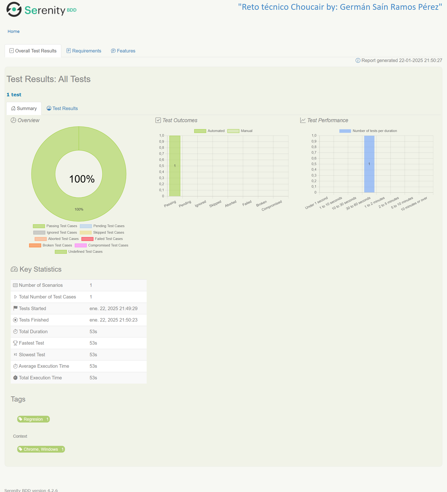
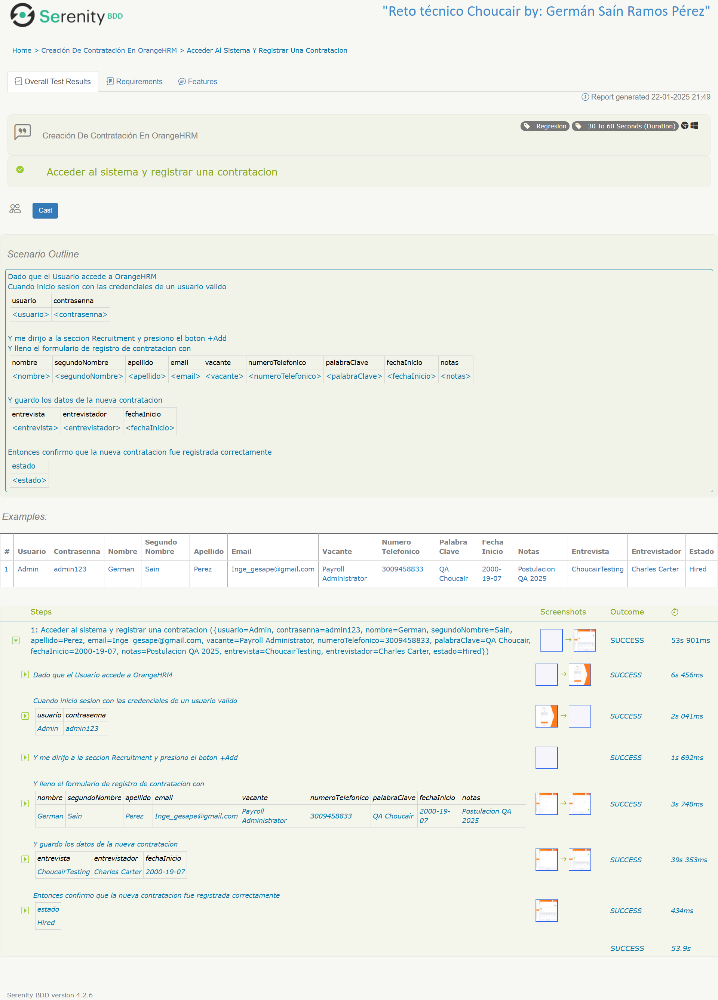
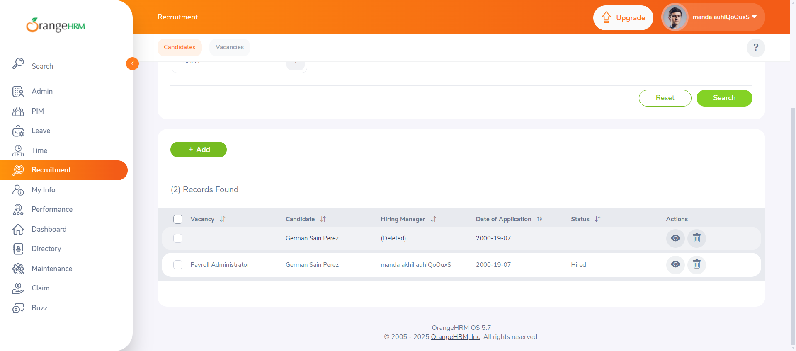

# Reto Técnico de Automatización - Choucair

## Descripción del Proyecto

Este proyecto de automatización se desarrolla utilizando **Selenium**, **Serenity BDD** y el patrón de diseño **Screenplay** con el lenguaje de programación **Java**. El objetivo principal es simular el proceso de contratación de una persona mediante el diligenciamiento de un formulario que solicita sus datos personales.

### Propósito

El código implementado realiza las siguientes acciones:

1. Accede a la plataforma de Orangehrm mediante credenciales de acceso.
2. Diligencia un formulario con los datos personales del candidato.
3. Valida la información ingresada en el formulario.
4. Verifica que el estado de contratación del candidato sea "Hired".

## Requisitos del Sistema

Para ejecutar este proyecto, asegúrese de contar con los siguientes requisitos:

- **Java Development Kit (JDK)** v11 o superior.
- **Gradle** v8 o superior.
- Navegador compatible con **Selenium WebDriver** (Google Chrome).
- Dependencias necesarias especificadas en el archivo `build.gradle`.

## Tecnologías Utilizadas

- **Lenguaje de Programación:** Java
- **Framework de Automatización:** Serenity BDD
- **Herramienta de Pruebas de Navegador:** Selenium WebDriver
- **Patrón de Diseño:** Screenplay

## Estructura del Proyecto

El proyecto sigue una estructura modular organizada según el patrón Screenplay:

- `tasks`: Define las tareas que los actores deben realizar.
- `interactions`: Define interacciones específicas entre el actor y la aplicación.
- `questions`: Verifica las condiciones o estados de la aplicación.
- `models`: Contiene las clases de datos para representar los elementos del dominio.
- `userinterfaces`: Define los localizadores de elementos de la interfaz.
- `runners`: Define los casos de prueba que se ejecutarán.
- `utils`: Define los métodos utilitarios.
## Configuración Inicial

1. **Clonar el Repositorio:**
   ```bash
   git clone https://github.com/gerramosdev/test_choucair.git
   cd german.ramos.perez.orange
   ```

2. **Instalar Dependencias:**
   Ejecute el simbolo del gestor de dependencia

3.  **Archivos de Configuración:**
   Verifique las propiedades de configuración en el archivo `serenity.conf`.

## Ejecución de Pruebas

1. **Ejecución con Gradle:**
   Utilice el siguiente comando para ejecutar las pruebas:
   ```bash
   gradlew clean test aggregate -Dtags=@Regression
   ```

2. **Generación de Reportes:**
   Una vez finalizada la ejecución, los reportes de Serenity BDD estarán disponibles en la carpeta `target/site/serenity`.

## Resultado Esperado

- Validar que los datos ingresados en el formulario coincidan con los esperados.
- Confirmar que el estado de contratación del candidato sea "Hired".

##Evidencia Serenity




